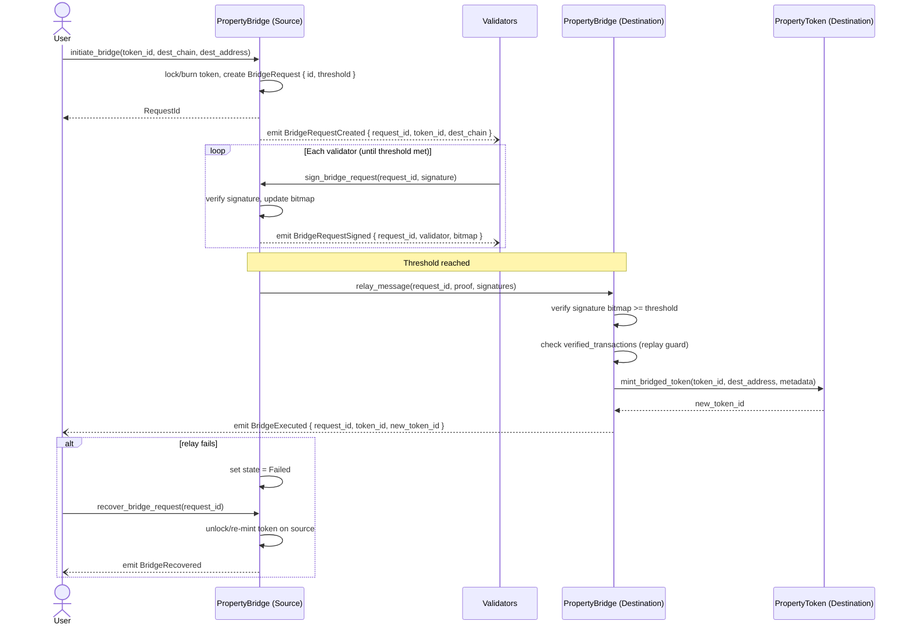

# Cross-Chain Bridge

```mermaid
sequenceDiagram
    actor User
    participant SrcBridge as PropertyBridge (Source)
    participant Validators
    participant DstBridge as PropertyBridge (Destination)
    participant Registry as PropertyToken (Destination)

    User->>SrcBridge: initiate_bridge(token_id, dest_chain, dest_address)
    SrcBridge->>SrcBridge: lock/burn token, create BridgeRequest { id, threshold }
    SrcBridge-->>User: RequestId
    SrcBridge--)Validators: emit BridgeRequestCreated { request_id, token_id, dest_chain }

    loop Each validator (until threshold met)
        Validators->>SrcBridge: sign_bridge_request(request_id, signature)
        SrcBridge->>SrcBridge: verify signature, update bitmap
        SrcBridge--)Validators: emit BridgeRequestSigned { request_id, validator, bitmap }
    end

    Note over SrcBridge,DstBridge: Threshold reached

    SrcBridge->>DstBridge: relay_message(request_id, proof, signatures)
    DstBridge->>DstBridge: verify signature bitmap >= threshold
    DstBridge->>DstBridge: check verified_transactions (replay guard)
    DstBridge->>Registry: mint_bridged_token(token_id, dest_address, metadata)
    Registry-->>DstBridge: new_token_id
    DstBridge--)User: emit BridgeExecuted { request_id, token_id, new_token_id }

    alt relay fails
        SrcBridge->>SrcBridge: set state = Failed
        User->>SrcBridge: recover_bridge_request(request_id)
        SrcBridge->>SrcBridge: unlock/re-mint token on source
        SrcBridge--)User: emit BridgeRecovered
    end
```
