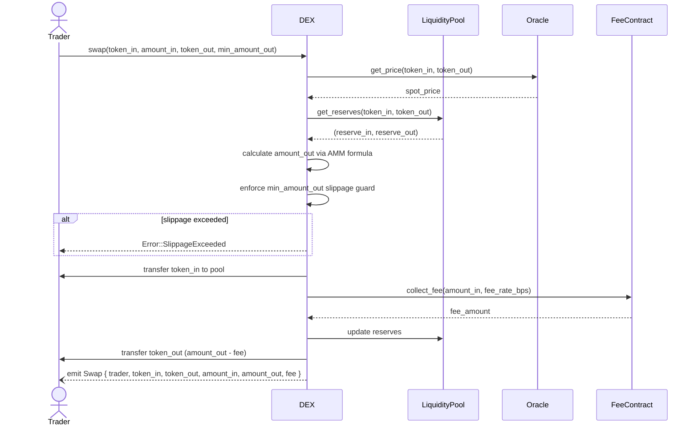

# DEX Swap

```mermaid
sequenceDiagram
    actor Trader
    participant DEX
    participant Pool as LiquidityPool
    participant Oracle
    participant FeeCollector as FeeContract

    Trader->>DEX: swap(token_in, amount_in, token_out, min_amount_out)
    DEX->>Oracle: get_price(token_in, token_out)
    Oracle-->>DEX: spot_price
    DEX->>Pool: get_reserves(token_in, token_out)
    Pool-->>DEX: (reserve_in, reserve_out)
    DEX->>DEX: calculate amount_out via AMM formula
    DEX->>DEX: enforce min_amount_out slippage guard

    alt slippage exceeded
        DEX-->>Trader: Error::SlippageExceeded
    end

    DEX->>Trader: transfer token_in to pool
    DEX->>FeeCollector: collect_fee(amount_in, fee_rate_bps)
    FeeCollector-->>DEX: fee_amount
    DEX->>Pool: update reserves
    DEX->>Trader: transfer token_out (amount_out - fee)
    DEX--)Trader: emit Swap { trader, token_in, token_out, amount_in, amount_out, fee }
```
