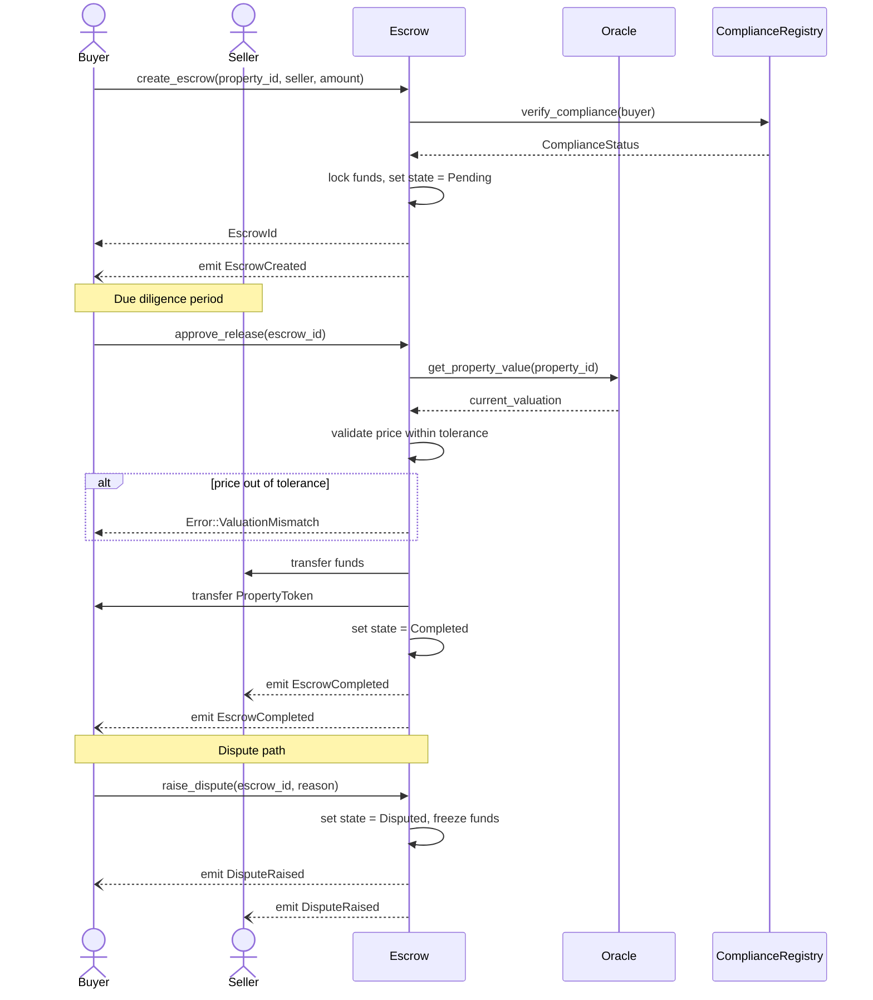

# Escrow Lifecycle

```mermaid
sequenceDiagram
    actor Buyer
    actor Seller
    participant Escrow
    participant Oracle
    participant Compliance as ComplianceRegistry

    Buyer->>Escrow: create_escrow(property_id, seller, amount)
    Escrow->>Compliance: verify_compliance(buyer)
    Compliance-->>Escrow: ComplianceStatus
    Escrow->>Escrow: lock funds, set state = Pending
    Escrow-->>Buyer: EscrowId
    Escrow--)Buyer: emit EscrowCreated

    Note over Buyer,Seller: Due diligence period

    Buyer->>Escrow: approve_release(escrow_id)
    Escrow->>Oracle: get_property_value(property_id)
    Oracle-->>Escrow: current_valuation
    Escrow->>Escrow: validate price within tolerance

    alt price out of tolerance
        Escrow-->>Buyer: Error::ValuationMismatch
    end

    Escrow->>Seller: transfer funds
    Escrow->>Buyer: transfer PropertyToken
    Escrow->>Escrow: set state = Completed
    Escrow--)Seller: emit EscrowCompleted
    Escrow--)Buyer: emit EscrowCompleted

    Note over Buyer,Escrow: Dispute path
    Buyer->>Escrow: raise_dispute(escrow_id, reason)
    Escrow->>Escrow: set state = Disputed, freeze funds
    Escrow--)Buyer: emit DisputeRaised
    Escrow--)Seller: emit DisputeRaised
```
