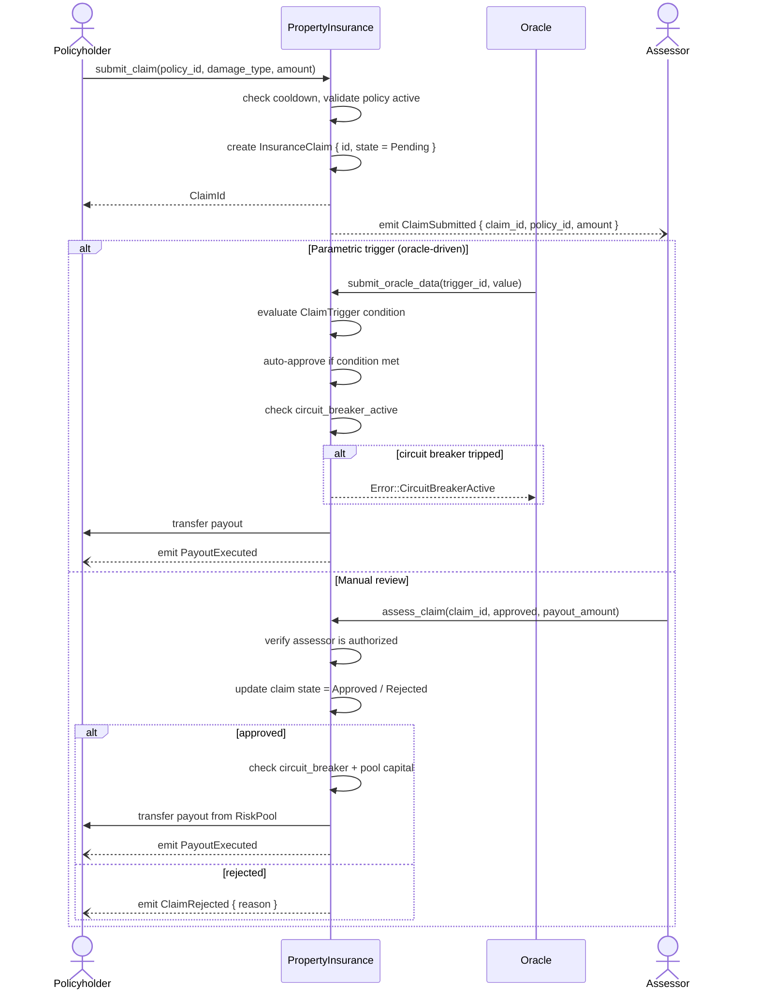

# Insurance Claim

```mermaid
sequenceDiagram
    actor Policyholder
    participant Insurance as PropertyInsurance
    participant Oracle
    actor Assessor

    Policyholder->>Insurance: submit_claim(policy_id, damage_type, amount)
    Insurance->>Insurance: check cooldown, validate policy active
    Insurance->>Insurance: create InsuranceClaim { id, state = Pending }
    Insurance-->>Policyholder: ClaimId
    Insurance--)Assessor: emit ClaimSubmitted { claim_id, policy_id, amount }

    alt Parametric trigger (oracle-driven)
        Oracle->>Insurance: submit_oracle_data(trigger_id, value)
        Insurance->>Insurance: evaluate ClaimTrigger condition
        Insurance->>Insurance: auto-approve if condition met
        Insurance->>Insurance: check circuit_breaker_active
        alt circuit breaker tripped
            Insurance-->>Oracle: Error::CircuitBreakerActive
        end
        Insurance->>Policyholder: transfer payout
        Insurance--)Policyholder: emit PayoutExecuted
    else Manual review
        Assessor->>Insurance: assess_claim(claim_id, approved, payout_amount)
        Insurance->>Insurance: verify assessor is authorized
        Insurance->>Insurance: update claim state = Approved / Rejected
        alt approved
            Insurance->>Insurance: check circuit_breaker + pool capital
            Insurance->>Policyholder: transfer payout from RiskPool
            Insurance--)Policyholder: emit PayoutExecuted
        else rejected
            Insurance--)Policyholder: emit ClaimRejected { reason }
        end
    end
```
