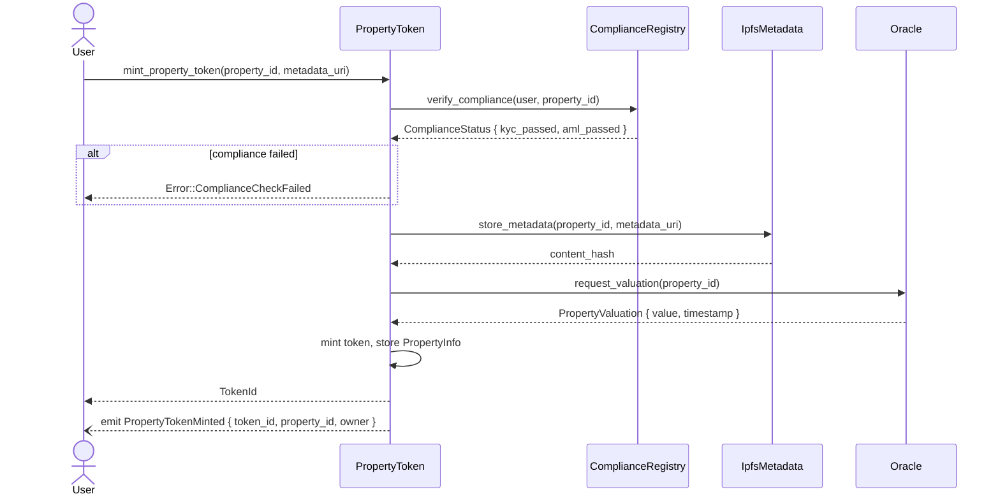

# Property Registration

```mermaid
sequenceDiagram
    actor User
    participant Registry as PropertyToken
    participant Compliance as ComplianceRegistry
    participant IPFS as IpfsMetadata
    participant Oracle

    User->>Registry: mint_property_token(property_id, metadata_uri)
    Registry->>Compliance: verify_compliance(user, property_id)
    Compliance-->>Registry: ComplianceStatus { kyc_passed, aml_passed }
    alt compliance failed
        Registry-->>User: Error::ComplianceCheckFailed
    end
    Registry->>IPFS: store_metadata(property_id, metadata_uri)
    IPFS-->>Registry: content_hash
    Registry->>Oracle: request_valuation(property_id)
    Oracle-->>Registry: PropertyValuation { value, timestamp }
    Registry->>Registry: mint token, store PropertyInfo
    Registry-->>User: TokenId
    Registry--)User: emit PropertyTokenMinted { token_id, property_id, owner }
```
