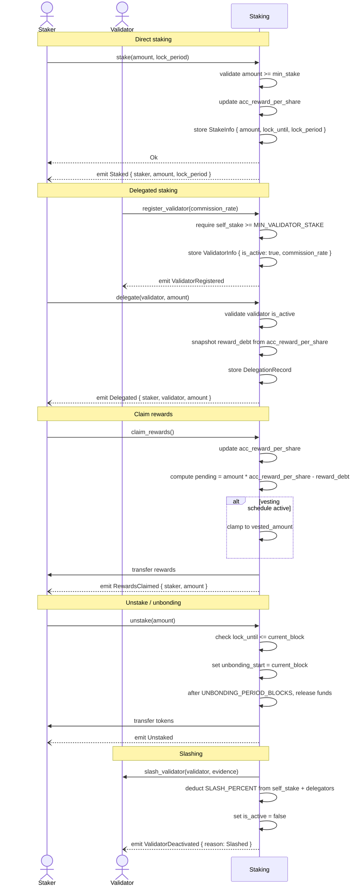

# Staking and Delegation

```mermaid
sequenceDiagram
    actor Staker
    actor Validator
    participant Staking

    Note over Staker,Staking: Direct staking
    Staker->>Staking: stake(amount, lock_period)
    Staking->>Staking: validate amount >= min_stake
    Staking->>Staking: update acc_reward_per_share
    Staking->>Staking: store StakeInfo { amount, lock_until, lock_period }
    Staking-->>Staker: Ok
    Staking--)Staker: emit Staked { staker, amount, lock_period }

    Note over Staker,Staking: Delegated staking
    Validator->>Staking: register_validator(commission_rate)
    Staking->>Staking: require self_stake >= MIN_VALIDATOR_STAKE
    Staking->>Staking: store ValidatorInfo { is_active: true, commission_rate }
    Staking--)Validator: emit ValidatorRegistered

    Staker->>Staking: delegate(validator, amount)
    Staking->>Staking: validate validator is_active
    Staking->>Staking: snapshot reward_debt from acc_reward_per_share
    Staking->>Staking: store DelegationRecord
    Staking--)Staker: emit Delegated { staker, validator, amount }

    Note over Staker,Staking: Claim rewards
    Staker->>Staking: claim_rewards()
    Staking->>Staking: update acc_reward_per_share
    Staking->>Staking: compute pending = amount * acc_reward_per_share - reward_debt
    alt vesting schedule active
        Staking->>Staking: clamp to vested_amount
    end
    Staking->>Staker: transfer rewards
    Staking--)Staker: emit RewardsClaimed { staker, amount }

    Note over Staker,Staking: Unstake / unbonding
    Staker->>Staking: unstake(amount)
    Staking->>Staking: check lock_until <= current_block
    Staking->>Staking: set unbonding_start = current_block
    Staking->>Staking: after UNBONDING_PERIOD_BLOCKS, release funds
    Staking->>Staker: transfer tokens
    Staking--)Staker: emit Unstaked

    Note over Validator,Staking: Slashing
    Staking->>Validator: slash_validator(validator, evidence)
    Staking->>Staking: deduct SLASH_PERCENT from self_stake + delegators
    Staking->>Staking: set is_active = false
    Staking--)Validator: emit ValidatorDeactivated { reason: Slashed }
```
