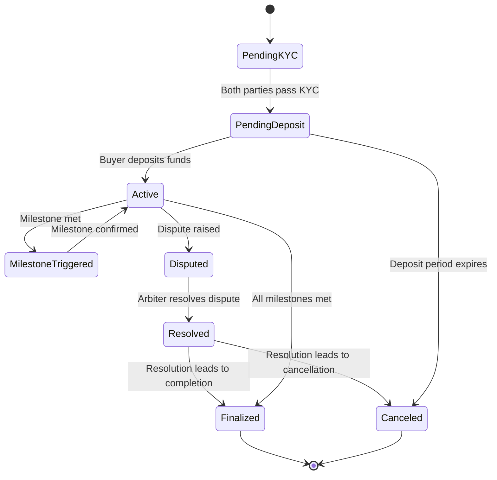

# Tutorial: Cross-Border Escrowed Property Purchase

This tutorial guides you through the process of a secure, cross-border property transaction using the Propchain escrow contract. We will cover the entire lifecycle, from initial setup to the final release of funds.

## Overview

The process involves a buyer, a seller, and an arbiter. The buyer's funds are held in escrow and released to the seller upon the successful completion of predefined milestones. An arbiter is available to resolve any disputes that may arise.

## State Machine Diagram



## 1. Setup: Buyer and Seller KYC

Before any transaction can take place, both the buyer and the seller must complete the Know Your Customer (KYC) process. This is a crucial step to ensure the legitimacy of all parties involved.

*   **Action:** Both buyer and seller submit their KYC documents through a trusted identity provider.
*   **On-chain:** The contract verifies the KYC status of both parties.

### TypeScript SDK Reference

```typescript
// Placeholder for SDK function to check KYC status
const buyerKycStatus = await propchainSdk.getKycStatus(buyerAddress);
const sellerKycStatus = await propchainSdk.getKycStatus(sellerAddress);
```

## 2. Deposit

Once both parties have been verified, the buyer deposits the agreed-upon funds into the escrow contract.

*   **Action:** The buyer calls the `deposit()` function on the escrow contract, sending the funds.
*   **On-chain:** The contract receives the funds and transitions the escrow state to `Active`.

### TypeScript SDK Reference

```typescript
// Placeholder for SDK function to deposit funds
await propchainSdk.escrow.deposit(escrowId, amount);
```

## 3. Milestone Triggers

Milestones are predefined conditions that must be met for the funds to be released. These could include things like the completion of a property inspection or the signing of legal documents.

*   **Action:** When a milestone is met, an authorized party (e.g., the seller or a trusted oracle) triggers the milestone on the contract.
*   **On-chain:** The contract records the milestone completion.

### TypeScript SDK Reference

```typescript
// Placeholder for SDK function to trigger a milestone
await propchainSdk.escrow.triggerMilestone(escrowId, milestoneId);
```

## 4. Dispute Path

If there is a disagreement between the buyer and seller, either party can raise a dispute. This will lock the funds until the dispute is resolved by the arbiter.

*   **Action:** The buyer or seller calls the `raiseDispute()` function.
*   **On-chain:** The escrow state is changed to `Disputed`. The arbiter is notified.

### TypeScript SDK Reference

```typescript
// Placeholder for SDK function to raise a dispute
await propchainSdk.escrow.raiseDispute(escrowId, reason);
```

## 5. Final Release

Once all milestones have been met and any disputes have been resolved, the funds are released to the seller.

*   **Action:** The `release()` function is called.
*   **On-chain:** The funds are transferred from the escrow contract to the seller's account. The escrow is now `Finalized`.

### TypeScript SDK Reference

```typescript
// Placeholder for SDK function to release funds
await propchainSdk.escrow.release(escrowId);
```